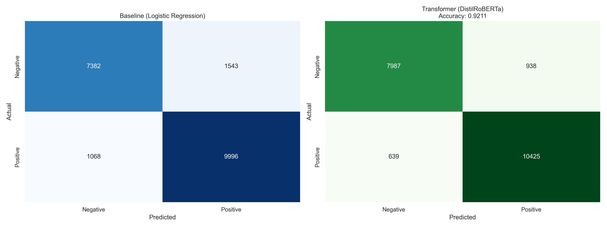
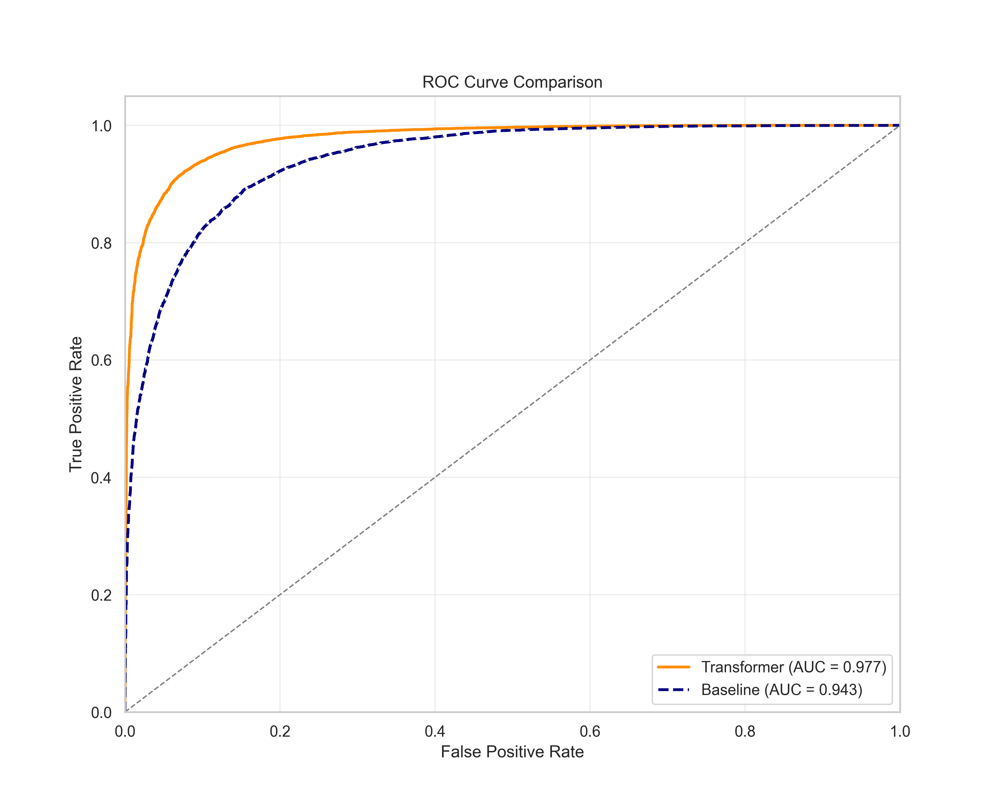
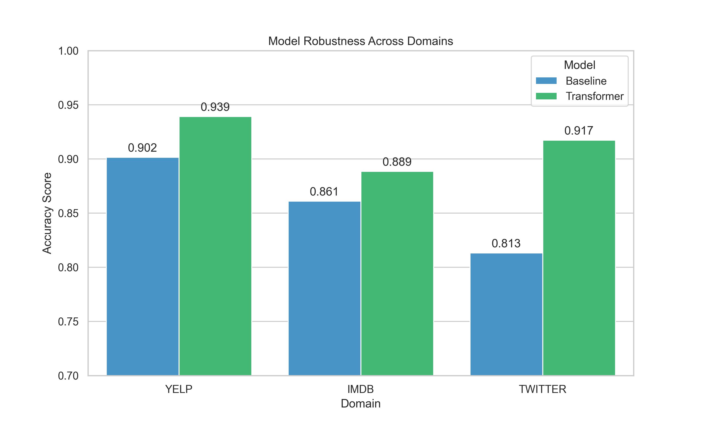

# 🧠 OmniSent: Domain-Agnostic Sentiment Analysis Engine

[](https://www.python.org/)
[](https://pytorch.org/)
[](https://huggingface.co/)
[](https://streamlit.io/)
[](https://opensource.org/licenses/MIT)

**OmniSent** is an end-to-end MLOps project that builds a robust Sentiment Analysis classifier capable of generalizing across three distinct text domains: **Formal** (IMDb Movies), **Commercial** (Yelp Reviews), and **Informal** (Twitter/X). 

By fine-tuning a **DistilRoBERTa** transformer, this system achieves **93.9% Accuracy**, significantly outperforming traditional statistical baselines while remaining lightweight enough for real-time inference.

---

## 🎥 Live Demo & Walkthrough

Click the image below to watch the **Real-Time Inference Engine** and **Explainable AI** features in action:


> *The dashboard demonstrates the model's ability to handle slang, sarcasm, and negation, with visual "Attention Highlights" explaining the decision.*

---

## 🏗️ System Architecture

The project follows a modular pipeline architecture, separating data engineering, model training, and deployment.

```mermaid
graph TD
    subgraph Data Pipeline
        A[Raw Data Sources] -->|IMDb, Yelp, TweetEval| B(Ingestion Script)
        B --> C{Preprocessing}
        C -->|Clean HTML, Regex, Lowercase| D[Unified Super-Dataset]
        D -->|Tokenization| E[Hugging Face Dataset]
    end

    subgraph Modeling Strategy
        E --> F[DistilRoBERTa Transformer]
        F -->|Fine-Tuning on RTX 3060 - FP16 | G[Optimized Model Weights]
        E --> H[TF-IDF Baseline]
        H --> I[Logistic Regression]
    end

    subgraph Inference & XAI
        U[User Input] --> J{Select Model}
        J -->|Transformer| K[Load Transformer]
        J -->|Baseline| L[Load Baseline]
        K --> M[Attention Extraction]
        K --> N[Sentiment Prediction]
        L --> N
    end

    subgraph User Interface
        N --> O[Streamlit Dashboard]
        M --> O
        O --> P((User))
    end

    style F fill:#f9f,stroke:#333,stroke-width:2px
    style O fill:#bbf,stroke:#333,stroke-width:2px
````

-----

## 📊 Performance & Evaluation

To ensure the solution is scientifically valid, I benchmarked a **Logistic Regression Baseline** against the **Fine-Tuned Transformer**.

| Metric | Baseline (TF-IDF) | OmniSent (Transformer) | Improvement |
| :--- | :--- | :--- | :--- |
| **Accuracy** | 86.94% | **93.90%** | **+6.96%** |
| **F1-Score** | 0.87 | **0.94** | **+0.07** |
| **Twitter Accuracy** | 81.3% | **91.2%** | **+9.9%** |

### Visualizations

*Generated using `src/visualize_results.py`*








| Confusion Matrix | ROC Curve |
| :---: | :---: |
|  |  |

> **Key Insight:** The Transformer model showed the biggest improvement on **Twitter data**, proving its ability to understand context and slang where the TF-IDF baseline failed.

-----

## 🚀 Key Technical Features

  * **Multi-Domain Data Engineering:** Aggregated 100k+ samples from disparate sources, normalizing labels and cleaning domain-specific noise (HTML tags in IMDb, User handles in Twitter).
  * **Hardware-Optimized Training:** Implemented **Mixed Precision (FP16)** training and Gradient Accumulation to fine-tune a 125M parameter model on a local NVIDIA RTX 3060 (6GB VRAM).
  * **Explainable AI (XAI):** Integrated `transformers-interpret` to provide token-level transparency. The UI highlights exactly *which* words caused a Positive or Negative prediction.
  * **Interactive Dashboard:** Built with **Streamlit**, allowing users to compare models side-by-side and view confidence intervals.

-----

## 🛠️ Installation & Usage

To run this project locally, you need Python 3.11 and a GPU (recommended).

### 1\. Clone the Repository

```cmd
git clone [https://github.com/yourusername/omnisent.git](https://github.com/yourusername/omnisent.git)
cd omnisent
```

### 2\. Set up Environment

```bash
# Create virtual environment (Python 3.11 Recommended)
python -m venv venv
# Activate (Windows)
venv\Scripts\activate
# Activate (Mac/Linux)
source venv/bin/activate
```

### 3\. Install Dependencies

*Note: We install PyTorch with CUDA support first to ensure GPU acceleration.*

```bash
# For Windows (CUDA 11.8/12.1)
pip install torch torchvision torchaudio --index-url [https://download.pytorch.org/whl/cu118](https://download.pytorch.org/whl/cu118)

# Install project requirements
pip install -r requirements.txt
```

### 4\. Download & Train (Optional)

*Pre-trained models are not included in the repo due to size. You can retrain them:*

```bash
cd src
# 1. Download Data
python ingest_data.py
# 2. Process Data
python process_data.py
# 3. Train Transformer (Takes ~20 mins on RTX 3060)
python train_transformer.py
```

### 5\. Launch the App

```bash
# Run from root directory
streamlit run app.py
```

-----

## 📂 Project Structure

```text
OmniSent/
├── data/                    # (Ignored by Git) Raw & Processed datasets
├── models/                  # (Ignored by Git) Trained model weights
├── notebooks/               # Jupyter experiments
├── plots/                   # Generated evaluation graphs
├── src/                     # Source code modules
│   ├── ingest_data.py       # Data downloading
│   ├── process_data.py      # Cleaning & Feature Engineering
│   ├── train_baseline.py    # Logistic Regression Training
│   ├── train_transformer.py # Transformer Fine-Tuning
│   └── visualize_results.py # Plot generation
├── app.py                   # Main Streamlit Application
├── requirements.txt         # Dependencies
└── README.md                # Project Documentation
```

-----

